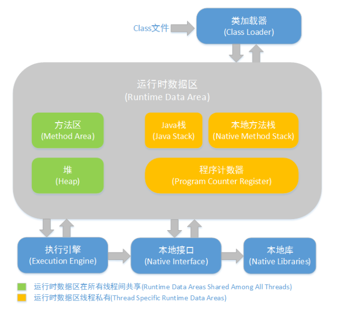

JVM内存结构由堆、栈、本地方法栈、方法区等部分组成
1. 堆：主要有新生代空间（Young）和老年代空间（Old），其中Young空间，又被分为2个部	分和3个板块，分别是1个Egen区，和2个Survivor区
2. 栈：线程私有，JVM为每个新创建的线程都分配一个栈，它的生命周期与线程相同。也就是说,对于一个Java程序来说，它的运行就是通过对栈的操作来完成的。每个方法被执行的时候都会同时创建一个栈帧（Stack Frame）用于存储局部变量表、操作栈、动态链接、方法出口等信息。每一个方法被调用直至执行完成的过程，就对应着一个栈帧在虚拟机栈中从入栈到出栈的过程，该过程具有先进后出的特性。
本地方法栈：用于支持native方法的执行，存储了每个native方法调用的状态
3. 方法区：存放了jvm初始化时加载器加载的类信息、静态变量、final类型的常量、属性和方法信息。（永久代和元空间都是方法区的一种实现，区别是，永久代使用的是JVM的堆内存空间，会内存溢出，而元空间使用的是物理内存，直接受到本机的物理内存限制。 ）
4. 程序计数器：程序计数器（Program Counter Register）是一块较小的内存空间，它的作用可以看做是当前线程所执行的字节码的行号指示器
> 方法区和堆是所有线程共享的内存区域；而java栈、本地方法栈和程序员计数器是运行是线程私有的内存区域。

jconsole 使用：

参考文献：

http://www.importnew.com/23792.html 
