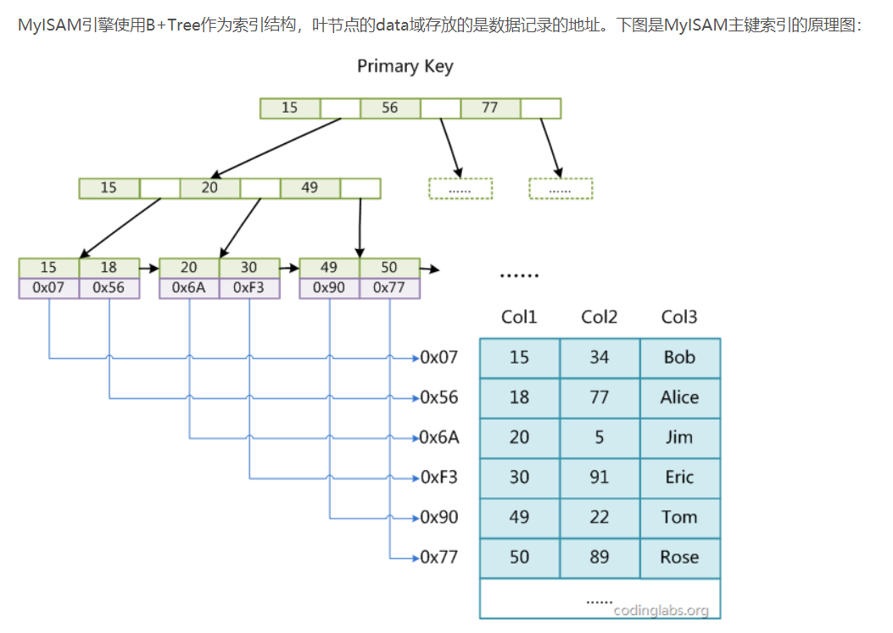
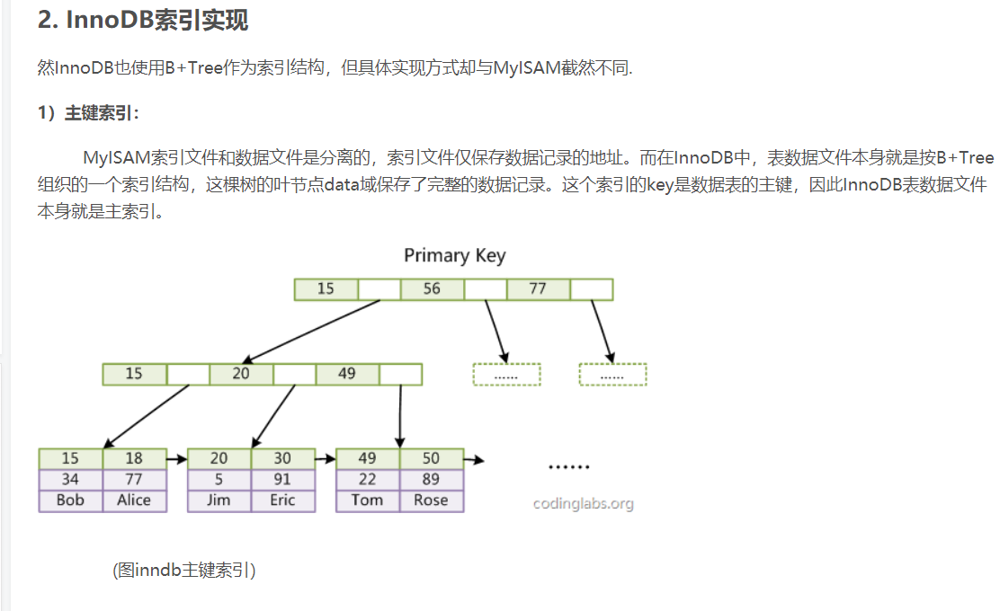
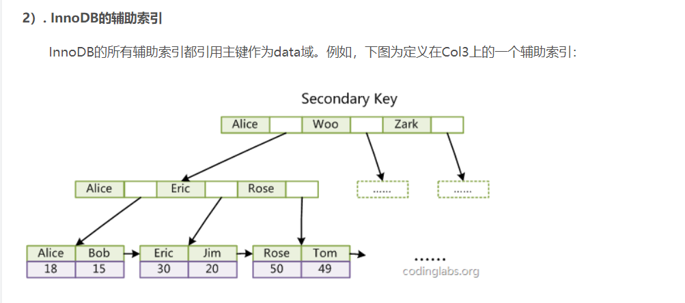
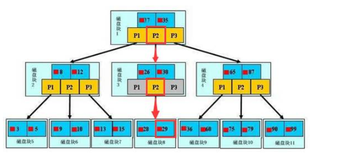

为了快速查询，很多时候，我们会建立不同的索引，满足需求，mysql主要索引引擎有MyISAM和InnoDB，两者都是使用B+Tree作为索引结构，两者的
区别： 一是主索引的区别，InnoDB的数据文件本身就是索引文件。而MyISAM的索引和数据是分开的。 二是辅助索引的区别：InnoDB的辅助索引data
域存储相应记录主键的值而不是地址。而MyISAM的辅助索引和主索引没有多大区别。

查询过程如下：

在上图中，如果要查找数据项29，那么首先会把磁盘块1由磁盘加载到内存，此时发生一次IO，在内存中用二分查找确定29在17和35之间，锁定磁盘块1
的P2指针，内存时间因为非常短（相比磁盘的IO）可以忽略不计，通过磁盘块1的P2指针的磁盘地址把磁盘块3由磁盘加载到内存，发生第二次IO，29在
26和30之间，锁定磁盘块3的P2指针，通过指针加载磁盘块8到内存，发生第三次IO，同时内存中做二分查找找到29，结束查询，总计三次IO。真实的情
况是，3层的b+树可以表示上百万的数据（h高度会影响数据量），如果上百万的数据查找只需要三次IO，性能提高将是巨大的，如果没有索引，每个数据
项都要发生一次IO，那么总共需要百万次的IO，显然成本非常非常高。   
性能优化点：  
1. 索引建立
2. sql中使用函数会导致索引失效
3. sql中like “xx%”索引生效，like “%xx”和like “%xx%”，索引不生效
4. in (1，2，3) 常量索引生效，in (子查询)，索引不生效
5. 缩小结果集查询

参考文献：  
https://blog.csdn.net/u010842515/article/details/68929687 MyISAM和InnoDB引擎区别
https://www.cnblogs.com/ssrstm/p/6806111.html
