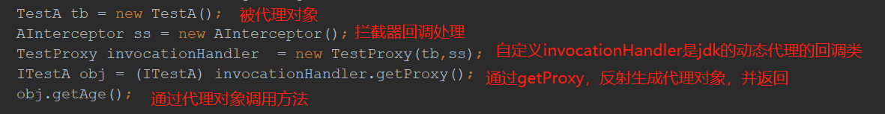
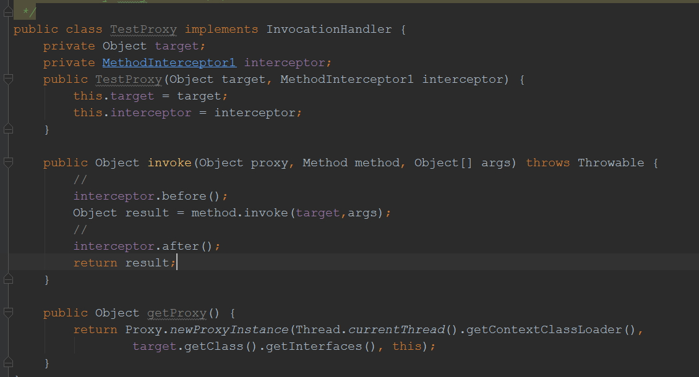
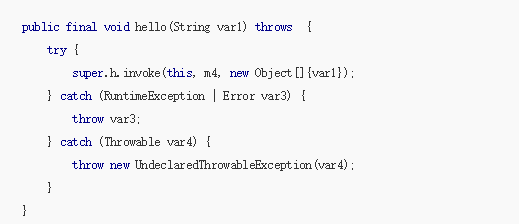
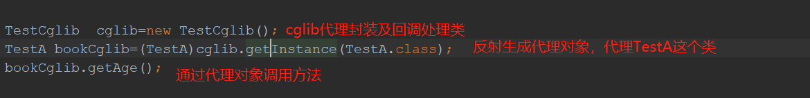
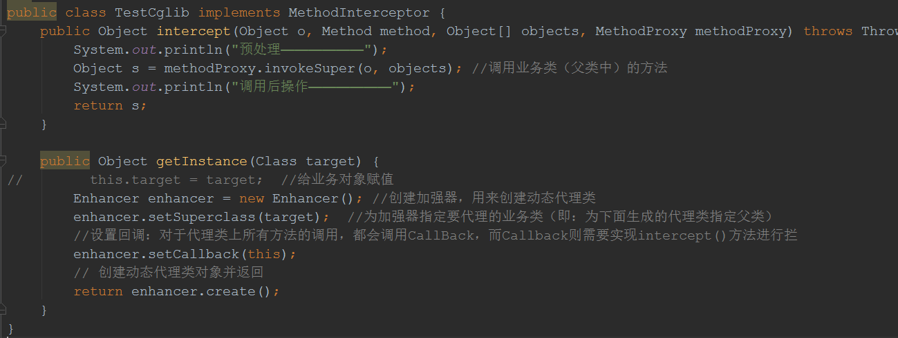
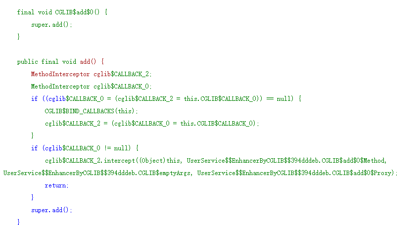

**Jdk动态代理(代理接口)**

通过获取委托类实现的所有接口，为每个接口方法创建一个代理方法，通过ProxyGenerator.generateProxyClass动态生成代理类字节码文件并加载
，反射生成代理对象，代理对象调用的时候通过自定义的InvocationHandler（super.h）调用invoke方法，在回调方法invoke中，使用反射调用原
对象的方法method.invoke(target, args);

**动态生成的代理类关键代码**

Cglib动态代理(代理类) 通过继承一个委托类，通过ASM框架strategy.generate(this)动态生成代理子类字节码文件并加载，反射生成对象，调用
的时候可以通过实现MethodInterceptor接口的intercept拦截方法，进行拦截， intercept方法中，前后增加处理代码，然后调用
proxy.invokeSuper(obj, args); （该方法，最终调用父类方法如super.add().），如果不拦截，则默认直接调用父类方法

**动态生成的代理类关键代码**

参考文献：

https://www.cnblogs.com/MOBIN/p/5597215.html