**二叉树：**  
1. 左子树上的所有节点值均小于根节点值，
2. 右子树上的所有节点值均不小于根节点值，
3. 左右子树也满足上述两个条件。
插入过程如下图：比较4与7，4<7，再比较4与7的左子树6，4<6，比较4与6的左子树3，4>3，比较4与3的右子树，为空，插入4。（字符串作为key比较可以用compareTo）
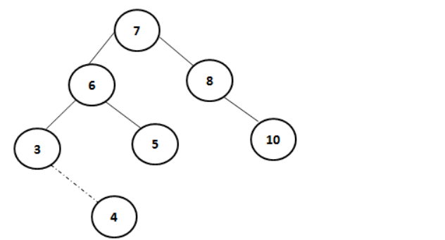

**删除分为三种情况：** 
1. p为叶子节点，直接删除该节点，再修改其父节点的指针（注意是父节点和不是根节点），如图a。
2. p为单支节点（即只有左子树或右子树）。让p的子树与p的父亲节点相连，删除p即可；（注意分是根节点和不是根节点）；如图b。
3. p的左子树和右子树均不空。找到p的后继y，因为y一定没有左子树，所以可以删除y，并让y的父亲节点成为y的右子树的父亲节点，并用y的值代替p的值；或者方法二是找到p的前驱x，x一定没有右子树，所以可以删除x，并让x的父亲节点成为y的左子树的父亲节点。如图c。
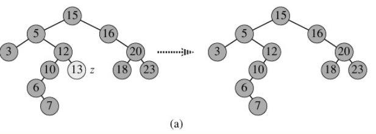
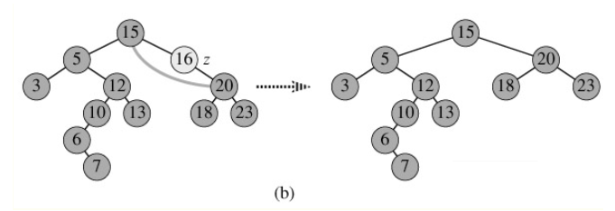
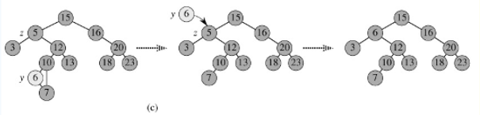

**红黑树：**
1. 每个节点颜色不是黑色，就是红色 
2. 根节点是黑色的 
3. 如果节点是红色的，则它的子节点必须是黑色的（反之不一定，没有连续的红节点） 
4. 从根节点到叶子节点的每条路径，必须包含相同数目的黑色节点
5. 红黑树继承二叉树的性质   
插入节点：
往一个空的红黑树中，依次插入数据：12 1 9 2 0 11 7 19 4
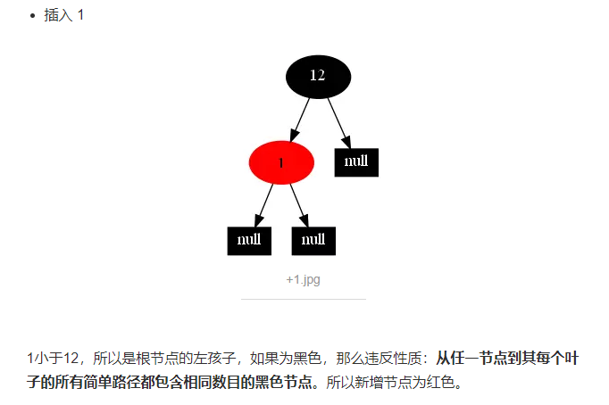
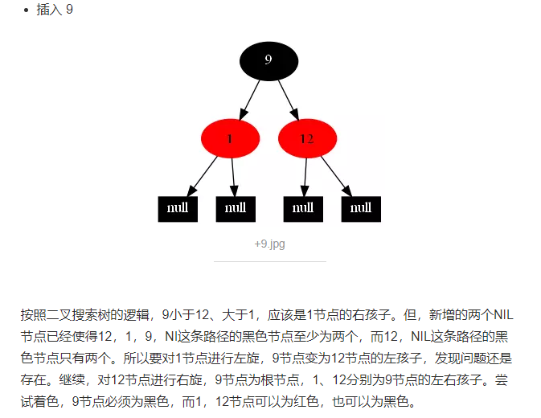
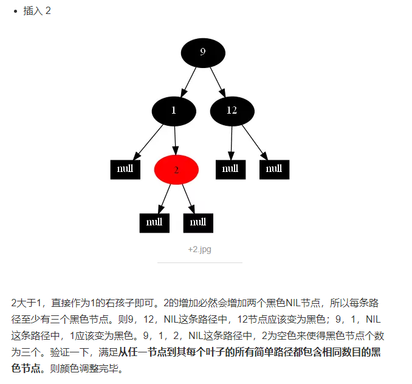
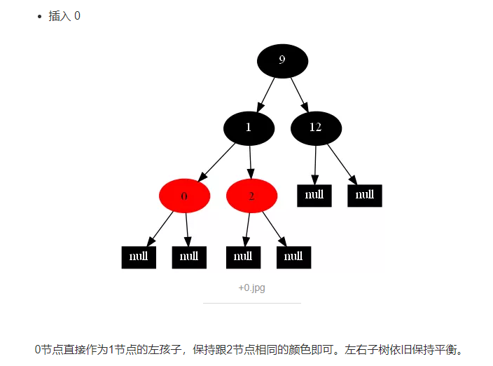
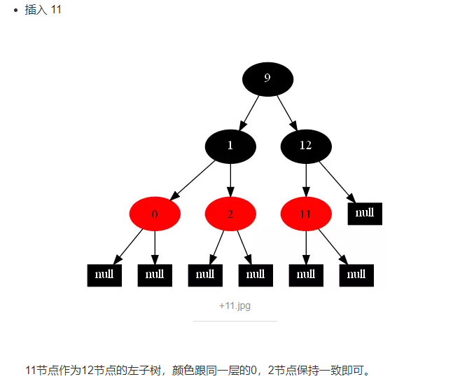
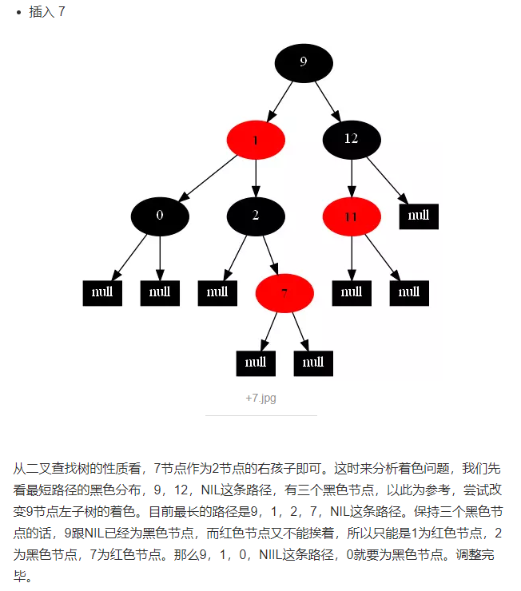
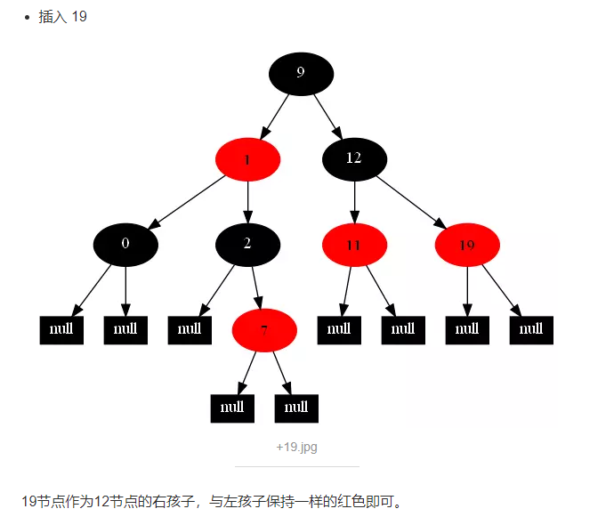
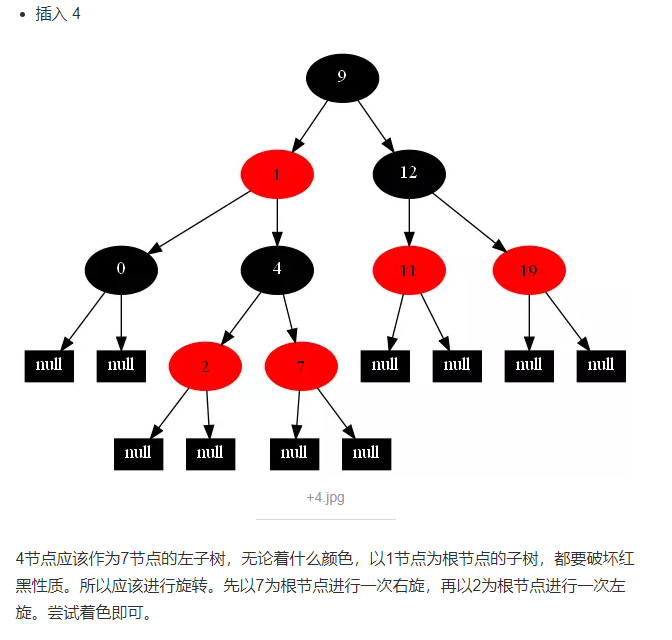
> 删除节点同插入分析方式。
通过任意一条从根到叶子简单路径上颜色的约束，红黑树保证最长路径不超过最短路径的二倍，因而近似平衡。

**b树：**  
B树的性质（m阶的B树，m表示节点的最大子节点数就是最大分支数，与高度h没有关系）
1. 树中每个结点最多含有m个孩子（m>=2）； 
2. 除根结点和叶子结点外，其它每个结点至少有[ceil(m / 2)]个孩子（其中ceil(x)是一个取上限的函数）；  
3、根结点至少有2个孩子（除非B树只包含一个结点：根结点）； 
4. 所有叶子结点都出现在同一层，叶子结点不包含任何关键字信息(可以看做是外部结点或查询失败的结点，指向这些结点的指针都为null)；（注：叶子节点只是没有孩子和指向孩子的指针，这些节点也存在，也有元素。类似红黑树中，每一个NULL指针即当做叶子结点，只是没画出来而已，2、3规则决定是平衡树）。 
5. 每个非终端结点中包含有n个关键字信息： (n，P0，K1，P1，K2，P2，......，Kn，Pn)。  
其中： 
    1. Ki (i=1...n)为关键字，且关键字按顺序升序排序K(i-1)< Ki。
    2. Pi为指向子树根的结点，且指针P(i-1)指向子树种所有结点的关键字均小于Ki，但都大于K(i-1)。 
    3. 关键字的个数n必须满足： [ceil(m / 2)-1]<= n <= m-1。比如有j个孩子的非叶结点恰好有j-1个关键码。
    
**B树拆分原则：** 达到最大关键字数时，中位上移，如5阶B树，1234插入下一个5，这时候为12345，违反关键字n<=（5-1），这时候3上移

**b+树：**  
在B-树基础上，为叶子结点增加链表指针，所有关键字都在叶子结点 中出现，非叶子结点作为叶子结点的索引；B+树总是到叶子结点才命中

**hash：**  

**倒排：**  

**总结：**  
1. 二叉树不是平衡树，让插入的值分别为1，2，3，4，5时，他会在右子树一条线上，这样跟链表是类似了，达不到高效查找的效果了
2. B树是一种多叉平衡查找树，红黑树是二叉平衡查找树结构，B树由于是多叉结构，对于元素数量非常多的情况下，树的深度不会像二叉结构那么大，可以保证查询效率。
3. b树每个节点都存储[ceil(m / 2)-1]<= n <= m-1个关键字，而b+树所有关键字都在叶子节点，非叶子节点作为叶子节点的索引，关键字都按从小到大顺序排列
4. B+树还有一个最大的好处，方便扫库，B树必须用中序遍历的方法按序扫库，而B+树直接从叶子结点挨个扫一遍就完了，B+树支持range-query非常方便，而B树不支持。这是数据库选用B+树的最主要原因

参考文献：  
常用算法：
https://blog.csdn.net/eson_15/article/details/51138663 二叉树  
https://blog.csdn.net/u014182411/article/details/69831492 二叉树  
https://www.cnblogs.com/aiyelinglong/archive/2012/03/27/2419972.html 二叉树  
https://blog.csdn.net/eson_15/article/details/51144079 红黑树  
https://www.jianshu.com/p/d25e490e2441 红黑树 +1  
https://blog.csdn.net/tanrui519521/article/details/80980135 红黑树  
https://www.jianshu.com/p/7dedb7ebe033 B树  
https://www.jianshu.com/p/6f68d3c118d6 b+树  
https://www.jianshu.com/p/db226e0196b4 b树、B+树  
https://www.cnblogs.com/boothsun/p/8970952.html 二叉、b、b+树  
https://www.cnblogs.com/dreamroute/p/8484457.html 倒排索引  
https://blog.csdn.net/CrankZ/article/details/80615789 倒排索引  
