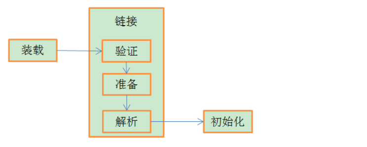
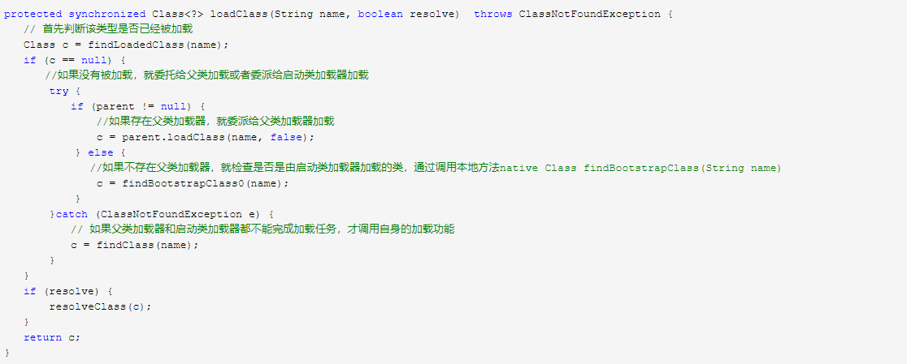

   JVM将类加载过程分为三个步骤：装载（Load），链接（Link）和初始化(Initialize)。
链接又分为三个步骤，如下图所示: 
 

1. 装载：通过类加载器，查找并加载类的二进制数据
2. 链接：
   1. 验证：确保被加载类的正确性；检查class文件是否符合JVM字节码格式的，正常情况由编译器生成的class文件肯定符合，如果不是，那需要验证通过才能下一步，安全考虑
   2. 准备：为类的静态变量分配内存，并将其初始化为默认值；如private static int a = 10
     在准备阶段即a=0，然后解析，再到初始化的时候才a=10
   3. 解析：把类中的符号引用转换为直接引用
3. 初始化：为类的静态变量赋予正确的初始值，及创建对象
> 类的加载指的是将类的.class文件中的二进制数据读入到内存中，将其放在运行时数据区的方法区内，然后在堆区创建一个这个类的java.lang.Class对象，用来封装类在方法区类的对象
4. 使用对象
5. 卸载

*类加载器*
1. 启动类加载器(Bootstrap ClassLoader)：负责加载 JAVA_HOME\lib 目录中的，或通过-Xbootclasspath参数指定路径中的，且被虚拟机认可（按文件名识别，如rt.jar）的类
2. 扩展类加载器(Extension ClassLoader)：负责加载 JAVA_HOME\lib\ext 目录中的，或通过java.ext.dirs系统变量指定路径中的类库
3. 应用程序类加载器(Application ClassLoader)：负责加载用户路径（classpath）上的类库
4. 自定义类加载器
> JDK中的ClassLoader

通过上面可以看出findClass()的实现，直接抛出一个异常，并且方法是protected，很明显这是留给我们开发者自己去实现的，我们可以通过重写findClass方法来实现我们自己的类加载器。
Springboot通过@EnableAutoConfiguration注解，会根据META-INF/spring.
factories文件自动配置，通过@Configuration代理原来的xml配置类，通过@ComponentScan配置类扫描路径，反射生成ioc容器

参考文献：

https://www.cnblogs.com/xdouby/p/5829423.html
https://blog.csdn.net/htf2620032/article/details/79298661 springlboot类加载
http://www.cnblogs.com/zheting/p/6707035.html springboot
https://blog.csdn.net/leileibest_437147623/article/details/80898878 springboot

