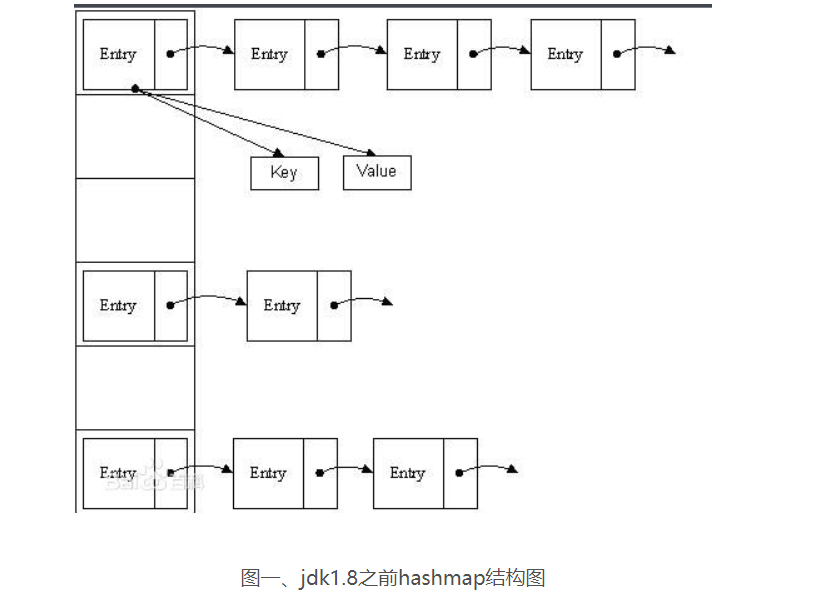
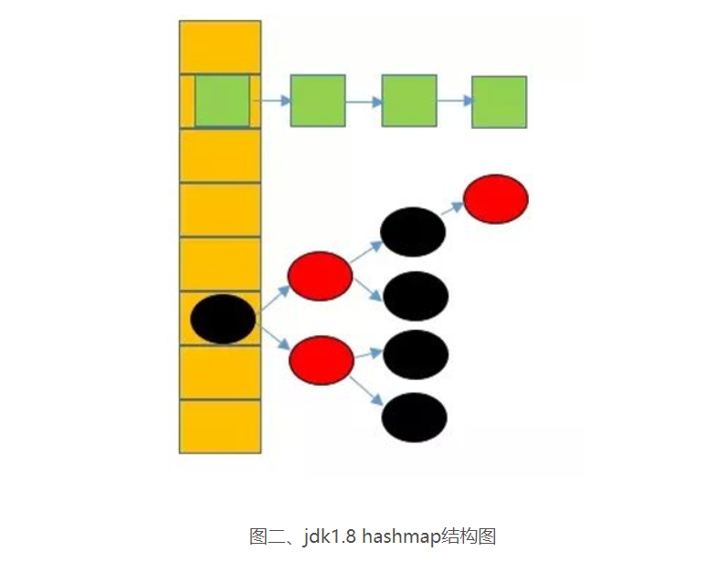

数组中内存是连续的，只需对 [基地址+元素大小*k] 就能找到第k个元素的地址，可以快速找到特定的值，但是想在有序数组中插入一个新的数据项，
就必须首先找出新数据项插入的位置，然后将比新数据项大的数据项向后移动一位，来给新的数据项腾出空间，删除同理，这样移动很费时。显而易见，
如果要做很多的插入和删除操作和删除操作，就不该选用有序数组。
另一方面，链表中可以快速添加和删除某个数据项，但是在链表中查找数据项可不容易，必须从头开始访问链表的每一个数据项，直到找到该数据项为止，
这个过程很慢。  

 **HashMap**  
在JDK1.8之前，HashMap采用数组+链表实现，即使用链表处理冲突，同一hash值的链表都存储在一个链表里。但是当位于一个桶中的元素较多，
即hash值相等的元素较多时，通过key值依次查找的效率较低

而JDK1.8中，HashMap采用数组+链表+红黑树实现，当链表长度超过阈值（8）时，将链表转换为红黑树，这样大大减少了查找时间

transient int size：表示当前HashMap包含的键值对数量  
transient int modCount：表示当前HashMap修改次数  
int threshold：表示当前HashMap能够承受的最多的键值对数量，一旦超过这个数量HashMap就会进行扩容  
threshold = loadFactor *容量，12=0.75*16  
final float loadFactor：负载因子，用于扩容  
static final int DEFAULT_INITIAL_CAPACITY = 1 << 4(表示1，左移4位，变成10000，也就是16.)：默认的初始容量  
static final float DEFAULT_LOAD_FACTOR = 0.75f：默认的负载因子  
static final int MIN_TREEIFY_CAPACITY = 64：当哈希表中的容量大于这个值时，表中的桶才能进行树形化，否则桶内元素太多时会扩容，而不是树形化，为了避免进行扩容、树形化选择的冲突，这个值不能小于 4 * TREEIFY_THRESHOLD  
static final int TREEIFY_THRESHOLD = 8：当桶中元素个数超过这个值时需要使用红黑树节点替换链表节点  
static final int UNTREEIFY_THRESHOLD = 6：当扩容时，桶中元素个数小于这个值就会把树形的桶元素 还原（切分）为链表结构  

1. 为什么hashMap的容量一定是2的次幂?  
首先hashmap构造函数，默认容量是16，如果是指定容量大小，那么最终会调用tableSizeFor(initialCapacity)方法是用来计算初始容量的, 
这个方法会返回一个比给定容量大的最小2的次幂的数，所以一定是2的次幂，举个例子:如果你给了9，比9大的最小2的次幂是16(2^4)；如果你给个27，
比27大的最小的2的次幂是32(2^5)，为什么一定要2的次幂呢？因为
key值落点的计算方式： [(n - 1) & hash] ，与“取余”是等价的算法
第一种方式计算出的key值落点越平均，hash冲突的可能性越小。
当容量大小是2的次幂时，(%和&)2种算法，hash冲突可能性是一样的，但是&效率高
当容量不是2的次幂时， &这种算法，key值落点更平均，hash冲突可能性更小，同时&效率也高
2. 负载因子为什么会影响HashMap性能，为什么默认是0.75f  
因为负载因子越大则HashMap的装填程度越高，也就是能容纳更多的元素，元素多了，链表大了，所以此时索引效率就会降低。反之，负载因子越小则链
表中的数据量就越稀疏，此时会对空间造成烂费，但是此时索引效率高

参考文献：  
https://blog.csdn.net/qq_25868207/article/details/55259978   
https://blog.csdn.net/u010890358/article/details/80496144 hashmap扩容   
https://blog.csdn.net/lizhongkaide/article/details/50595719 hashmap原理   
https://blog.csdn.net/qq_36178899/article/details/84333151 hashmap原理   
https://segmentfault.com/a/1190000012926722 hashmap原理  
https://segmentfault.com/a/1190000017509668 hashmap落点均匀  
https://blog.csdn.net/u010841296/article/details/82832166 hashmap容量大小  
http://www.360linker.com/sj/643.jhtml hashmap容量大小  

