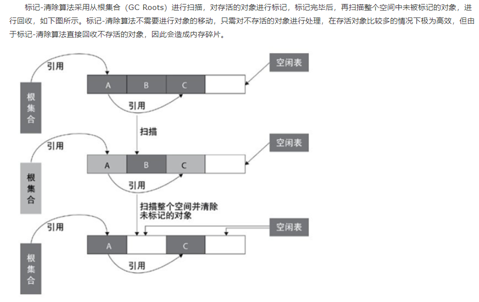
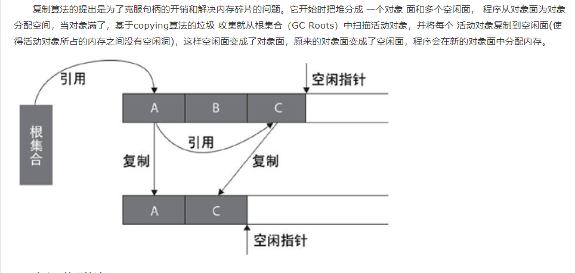
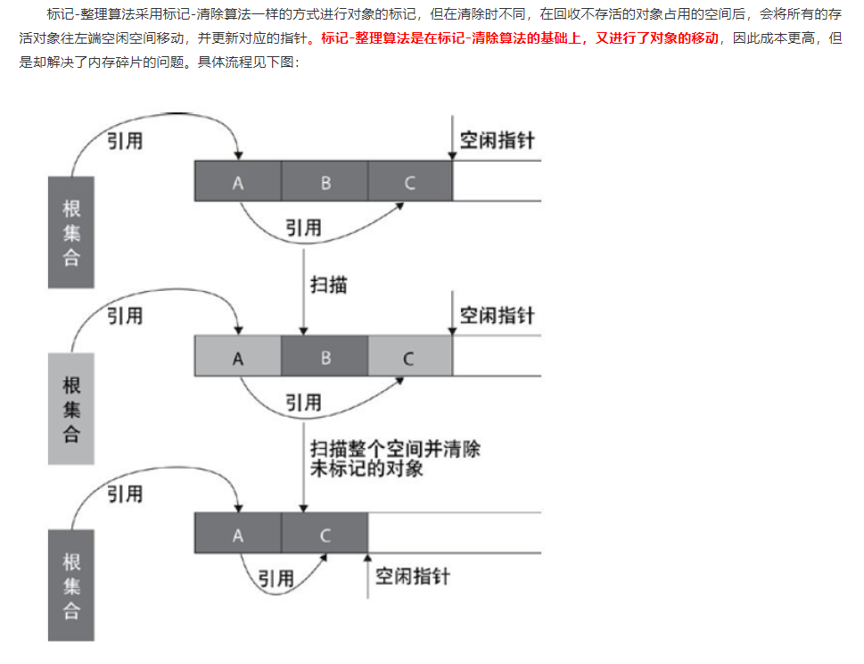
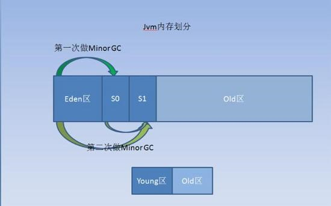

判断对象是否存活一般有两种方式：
1. 引用计数：每个对象有一个引用计数属性，新增一个引用时计数加1，引用释放时计数减1，计数为0时可以回收。此方法简单，无法解决对象相互循环引用的问题。 
2. 可达性分析（Reachability Analysis）：从GC Roots开始向下搜索，搜索所走过的路径称为引用链。当一个对象到GC Roots没有任何引用链相连时，则证明此对象是不可用的，不可达对象

**什么是根引用？**

在JAVA语言中，可作为GC ROOTS的对象包括：
1. 虚拟机栈中引用的对象（栈帧中的本地变量表）；
2. 方法区中类静态属性引用的属性；
3. 方法区中常量引用的对象；
4. 本地方法栈中JNI（Native法防）引用的对象。
    
GC最基础的算法有三种：标记 -清除算法、复制算法、标记-压缩算法，我们常用的垃圾回收器一般都采用分代收集算法

**标记-清除算法（Mark-Sweep）**

- 优点：解决了循环引用的问题。
- 缺点：
   - 暂停整个应用；
   - 会产生内存碎片。
   - 不管你这个对象是不是可达的，即是不是垃圾，都要在清楚阶段被检查一遍，非常耗时.
   
**复制算法(Copying)**

- 优点：不会出现碎片问题。
- 缺点：暂停整个应用，需要2倍的内存空间

**标记-整理算法(Mark-compact)**

**分代收集算法**

1. 年轻代（Young区）的回收算法 (回收主要以Copying算法为主) Minor GC
新生代内存按照8:1:1的比例分为一个eden区和两个survivor(survivor0,survivor1)区
指发生在新生代的垃圾收集动作，因为 Java 对象大多都具备朝生夕灭的特性，所以 Minor GC 非常频繁，一般回收速度也比较快。
新生代通常存活时间较短，因此基于Copying算法来进行回收，所谓Copying算法就是扫描出存活的对象，并复制到一块新的完全未使用的空间中，对应于新生代，就是在Eden和FromSpace或ToSpace之间copy。新生代采用空闲指针的方式来控制GC触发，指针保持最后一个分配的对象在新生代区间的位置，当有新的对象要分配内存时，用于检查空间是否足够，不够就触发GC。当连续分配对象时，对象会逐渐从eden到survivor，最后到旧生代
2. 年老代（Old区）的回收算法（回收主要以Mark-Compact算法为主）Full GC
指发生在老年代的 GC。旧生代与新生代不同，对象存活的时间比较长，比较稳定，因此采用标记(Mark)算法来进行回收，所谓标记就是扫描出存活的对象，然后再进行回收未被标记的对象，回收后对用空出的空间要么进行合并，要么标记出来便于下次进行分配，总之就是要减少内存碎片带来的效率损耗。Major GC 是清理永久代
   1. Eden区域是用来存放使用new或者newInstance等方式创建的对象，默认都是存放在Eden区，除非这个对象太大，或者超过了设定的阈值-XX:PretenureSizeThresold,这样的对象会被直接分配到Old区域。
   2. 2个Survivor（幸存）区，一般称S0，S1，理论上他们是一样大的，解释一下，他们是如何工作的：
在不断创建对象的过程中，Eden区会满，这时候会开始做Young G也叫Minor GC，而Young空间的第一次GC就是找出Eden区中，幸存活着的对象，然后将这些对象，放到S0，或S1区中的其中一个， 假设第一次选择了S0，它会逐步将活着的对象拷贝到S0区域，但是如果S0区域满了，剩下活着的对象只能放old区域了，接下来要做的是，将Eden区域 清空，此时时候S1区域也是空的。
当第二次Eden区域满的时候，就将Eden区域中活着的对象+S0区域中活着的对象，迁移到S1中，如果S1放不下，就会将剩下的部门，放到Old区域中，只是这次对象来源区域增加了S0，最后会将Eden区+S0区域，清空
第三次和第四次依次类推，始终保证S0和S1有一个是空的，用来存储临时对象，用于交换空间的目的，反反复复多次没有被淘汰的对象，将会放入old区域中，默认是15次。具体的交换过程就和上图中的信息相似

参考文献：

https://www.cnblogs.com/aspirant/p/8662690.html